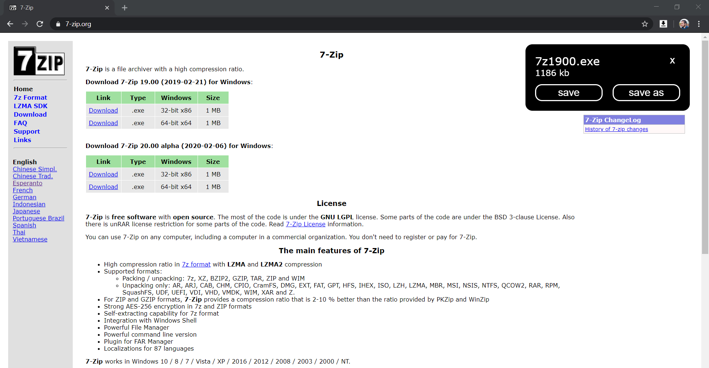

# Save | SaveAs | Cancel

## What It Is

This Chrome Extension allows a User to choose whether to Save | SaveAs | Cancel a Download.

## How It Works

After clicking a Link on a Webpage a Popup on the top-right of the Screen informs the User of the File's Name and Size and offers the Options to Save | SaveAs | Cancel the Download.

## Screenshot

## How To Install It

- Download the Files.
- Navigate to chrome://extensions/.
- Activate Developer Mode.
- Click on Load Unpacked.
- Select the Folder you just downloaded.
